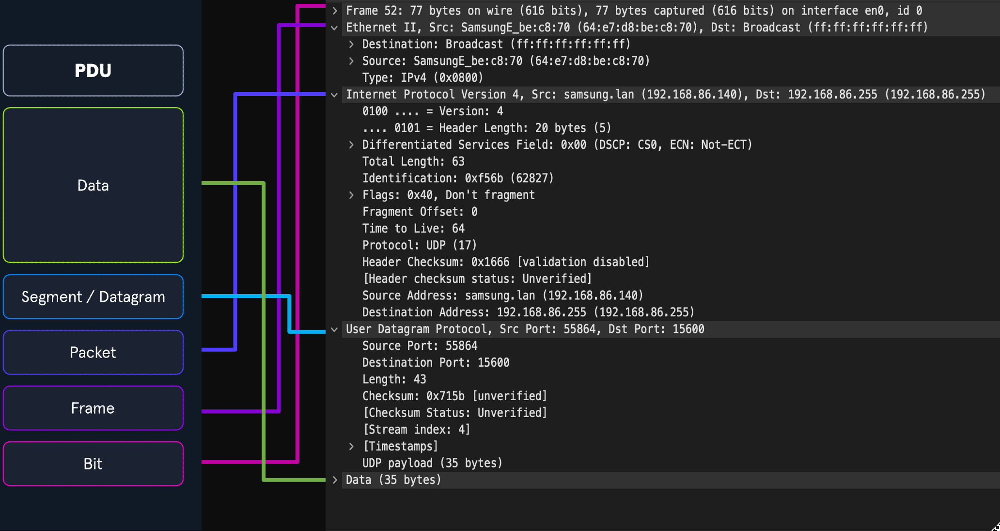

# Phân tích Chi tiết: Networking Primer (Lớp 1-4)

## 1. Đơn vị Dữ liệu Giao thức (PDU - Protocol Data Unit) & Sự Đóng gói

### Định nghĩa & Cấu trúc PDU
* **PDU là gì?** Là một gói dữ liệu bao gồm **thông tin điều khiển (control information)** và **dữ liệu (data)** được đóng gói từ mỗi lớp của mô hình OSI.
* **Sự tương quan giữa các lớp:**
    * Lớp 1-4 OSI tập trung vào vận chuyển.
    * Lớp 5-7 OSI tập trung vào dữ liệu người dùng.
    * Trong mô hình TCP/IP, PDU được hình thành dựa trên chức năng thực tế hơn là lý thuyết.

### Quy trình Đóng gói (Encapsulation) - "Cái bong bóng"
* **Cơ chế:** Khi dữ liệu di chuyển xuống ngăn xếp giao thức (protocol stack), mỗi lớp sẽ bao bọc dữ liệu của lớp trước đó vào một "bong bóng" mới gọi là sự đóng gói.
* **Header (Tiêu đề):** "Bong bóng" này thêm các thông tin cần thiết vào header của PDU, bao gồm:
    * Dữ liệu được giữ bởi lớp trước đó.
    * Các cờ hoạt động (Operational flags).
    * Các tùy chọn cần thiết để đàm phán giao tiếp.
    * Địa chỉ IP nguồn và đích.
    * Cổng (Ports).
    * Giao thức vận chuyển và ứng dụng.

**Lưu ý về Wireshark:**
Khi xem chi tiết gói tin (Packet Breakdown) trong Wireshark, thứ tự hiển thị sẽ bị **ngược**.
* *Lý do:* Wireshark hiển thị theo thứ tự gói tin được "mở gói" (unencapsulated) khi nhận được, tức là đi từ lớp thấp nhất lên lớp cao nhất.

---

## 2. Cơ chế Định địa chỉ (Addressing Mechanisms)

Để chuyển gói tin đến đúng đích, hệ thống sử dụng các cơ chế địa chỉ sau:

### A. Địa chỉ MAC (Media Access Control)
* **Định nghĩa:** Là địa chỉ vật lý gắn liền với mỗi giao diện mạng (interface) của thiết bị.
* **Định dạng:** 48-bit (6 octets), biểu diễn dưới dạng hệ thập lục phân (Hexadecimal). Ví dụ: `00:1A:2B:3C:4D:5E`.
* **Phạm vi hoạt động:** Lớp 2 (Data Link Layer).
* **Cơ chế hoạt động (Quan trọng):**
    * Dùng để giao tiếp **Host-to-Host** trong cùng một miền quảng bá (Broadcast domain).
    * **Khi đi qua Router (Lớp 3):**
        1.  Nếu PDU cần đi ra mạng ngoài, nó được gửi đến giao diện Lớp 3 đầu ra (egress interface) của Router.
        2.  Tại Lớp 2, PDU trông như thể được gửi đến Router.
        3.  Router xác định đường đi tiếp theo dựa trên địa chỉ Lớp 3 (IP).
        4.  **Hành động của Router:** Nó **gỡ bỏ (strips)** lớp đóng gói Lớp 2 cũ và **thay thế** bằng thông tin mới chỉ định địa chỉ vật lý của trạm kế tiếp trong hành trình.

### B. Địa chỉ IP (Internet Protocol)
Được phát triển để chuyển dữ liệu qua các ranh giới mạng (Routing). Bản chất là giao thức phi kết nối (Connectionless), không đảm bảo dữ liệu đến nơi (cần TCP hỗ trợ).

#### IPv4 (Internet Protocol version 4)
* **Định dạng:** 32-bit (4 octets), biểu diễn dạng số thập phân. Mỗi octet từ 0-255.
* **Ví dụ:** `192.168.86.243`.
* **Vị trí:** Lớp 3 (OSI) hoặc Lớp 2 (TCP/IP - Internet Layer).

#### IPv6 (Internet Protocol version 6)
* **Lý do ra đời:** Sự cạn kiệt địa chỉ IPv4. (Trước khi có IPv6, IPv4 đã phải dùng VLSM và CIDR để kéo dài thời gian sử dụng).
* **Định dạng:** 128-bit (16 octets), biểu diễn dạng Hexadecimal.
* **Lợi ích vượt trội:**
    * Không gian địa chỉ khổng lồ.
    * Hỗ trợ Multicasting tốt hơn.
    * Định địa chỉ toàn cầu cho mỗi thiết bị.
    * Bảo mật tích hợp sẵn (IPSec).
    * Header đơn giản hóa giúp xử lý nhanh hơn, không cần gán lại địa chỉ khi di chuyển giữa các kết nối.
* **Các loại địa chỉ IPv6:**
    1.  **Unicast:** Địa chỉ cho một giao diện đơn lẻ (Host-to-Host).
    2.  **Anycast:** Địa chỉ cho nhiều giao diện, nhưng gói tin chỉ được gửi đến giao diện **gần nhất** hoặc tốt nhất (Load balancing).
    3.  **Multicast:** Địa chỉ cho nhiều giao diện, tất cả đều nhận được gói tin (One-to-Many).
    4.  **Broadcast:** **Không tồn tại** trong IPv6 (được thay thế bằng Multicast).
* **Tỷ lệ áp dụng:** Khoảng 40% toàn cầu.

---

## 3. Cơ chế Vận chuyển (Transport Mechanisms - Lớp 4)

Lớp vận chuyển đóng vai trò như "trung tâm điều khiển" (control hub), chịu trách nhiệm đóng gói dữ liệu từ lớp trên xuống và lắp ráp lại dữ liệu từ lớp dưới lên.

### So sánh chi tiết TCP vs UDP

| Đặc điểm | TCP (Transmission Control Protocol) | UDP (User Datagram Protocol) |
| :--- | :--- | :--- |
| **Kiểu truyền** | Hướng kết nối (Connection-oriented). | Phi kết nối (Connectionless). "Bắn và quên" (Fire and forget). |
| **Thiết lập** | Bắt tay 3 bước để đảm bảo kết nối. | Không cần biết đích đến có đang nghe hay không. |
| **Giao vận dữ liệu** | Dựa trên luồng hội thoại (Stream-based). | Theo từng gói tin (Packet by packet). |
| **Nhận diện dữ liệu** | Sử dụng số thứ tự (Sequence) và xác nhận (Ack) để kiểm soát. | Không quan tâm. |
| **Tốc độ** | Chậm hơn do overhead (xử lý phụ) nhiều. | Nhanh nhưng không tin cậy. |
| **Ví dụ sử dụng** | SSH, Web (cần sự trọn vẹn, không được sai lệnh). | Streaming video, DNS (cần tốc độ, chấp nhận mất vài pixel). |

### Quy trình Bắt tay 3 bước (TCP Three-way Handshake)
TCP sử dụng các cờ (Flags) trong header để thiết lập phiên.
1.  **Client gửi SYN:**
    * Cờ **SYN** bật (On).
    * Gửi kèm số thứ tự (Sequence number) khởi tạo ngẫu nhiên.
    * Đàm phán các tùy chọn (Window size, MSS...).
    * Ví dụ Port: Client dùng cổng cao ngẫu nhiên (57678) gửi tới cổng Web (80).
2.  **Server gửi SYN/ACK:**
    * Cờ **SYN** bật (để đàm phán số thứ tự của server).
    * Cờ **ACK** bật (để xác nhận gói SYN của client).
3.  **Client gửi ACK:**
    * Cờ **ACK** bật (xác nhận đồng ý đàm phán).
    * Kết nối được thiết lập.

### Quy trình Ngắt kết nối (TCP Session Teardown)
Kết thúc phiên làm việc một cách "duyên dáng" (gracefully) để đảm bảo toàn vẹn dữ liệu.
* Sử dụng cờ **FIN** (Finished).
* **Trình tự gói tin:**
    1.  **FIN, ACK:** Bên gửi báo hiệu đã xong việc.
    2.  **FIN, ACK:** Bên nhận xác nhận (ACK) và cũng gửi tín hiệu kết thúc (FIN) của mình.
    3.  **ACK:** Bên gửi xác nhận lần cuối.
* Khi thấy chuỗi này, kết nối được coi là đã đóng an toàn.